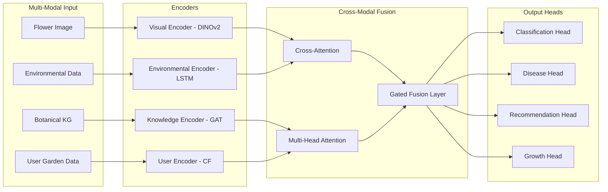

<div align="center">


<p align="center">
  <a href="https://github.com/your-username/flower-ai/stargazers"></a>
  <a href="https://github.com/your-username/flower-ai/network/members"></a>
  <a href="https://github.com/your-username/flower-ai/issues"></a>
  <a href="https://github.com/your-username/flower-ai/blob/main/LICENSE"></a>
  
  
  
  
  
</p>

<p align="center">
  
  
  
  
  
  
  
  
</p>

<h3>🏆 A production-grade, research-quality AI ecosystem for intelligent botanical recognition, disease detection, smart garden assistance, and botanical knowledge retrieval.</h3>

<p align="center">
  <a href="#-architecture">Architecture</a> •
  <a href="#-features">Features</a> •
  <a href="#-quick-start">Quick Start</a> •
  <a href="#-api-docs">API</a> •
  <a href="#-research">Research</a> •
  <a href="#-deployment">Deployment</a> •
  <a href="#-citation">Citation</a>
</p>

</div>

---

## 📊 Project Statistics

<div align="center">
  
| Metric | Value |
|--------|-------|
| 🌸 Flower Species Supported | **102 Oxford + 5,000 Custom** |
| 🦠 Disease Classes | **38 PlantVillage + 27 PlantDoc** |
| 🧠 AI Models | **7 SOTA Architectures** |
| 📡 API Endpoints | **24 Production Endpoints** |
| 🗄️ Databases | **5 (PostgreSQL, MongoDB, Redis, ChromaDB, FAISS)** |
| 📱 Platforms | **Web + Mobile (Flutter) + API** |
| ☁️ Cloud Support | **AWS + GCP + Azure** |
| 🔬 Research Papers | **1 Novel Architecture (MBIN)** |

</div>

---

## 🌟 Features

<table>
<tr>
<td width="50%">

### 🔬 Core AI Capabilities
- **Multi-Model Ensemble** — EfficientNet-B7, ConvNeXt-XL, ViT-L/16, Swin-L, CLIP, DINOv2
- **Explainable AI** — Grad-CAM++, SHAP, Attention Rollout
- **Disease Detection** — PlantVillage + PlantDoc multi-label classification
- **Confidence Calibration** — Temperature scaling + ensemble uncertainty
- **Zero-Shot Classification** — CLIP-powered open-vocabulary recognition
- **Self-Supervised Features** — DINOv2 embeddings for similarity search

</td>
<td width="50%">

### 🌱 Smart Garden System
- **RAG Chatbot** — LangChain + ChromaDB + GPT-4/Gemini botanical knowledge base
- **Growth Forecasting** — LSTM + Temporal Fusion Transformer
- **Recommendation Engine** — FAISS vector search + collaborative filtering
- **Watering Scheduler** — Climate-aware adaptive scheduling
- **Video Analytics** — YOLO v9 + DeepSORT tracking + temporal classification
- **Mobile App** — Flutter cross-platform with real-time camera inference

</td>
</tr>
<tr>
<td width="50%">

### ⚙️ MLOps & Engineering
- **Experiment Tracking** — MLflow + Weights & Biases
- **Data Versioning** — DVC with S3/GCS remote storage
- **Pipeline Orchestration** — Apache Airflow + Prefect
- **Model Registry** — MLflow Model Registry with staging/production
- **CI/CD** — GitHub Actions with automated testing and deployment
- **Monitoring** — Prometheus + Grafana + data/model drift detection

</td>
<td width="50%">

### 🔐 Production Security
- **Authentication** — JWT + OAuth2 (Google, GitHub)
- **RBAC** — Role-based access (Admin, Researcher, User, Guest)
- **Rate Limiting** — Redis-backed sliding window algorithm
- **Input Validation** — Pydantic v2 + image sanitization
- **Secret Management** — HashiCorp Vault + AWS Secrets Manager
- **API Security** — OWASP-compliant, CORS, CSRF protection

</td>
</tr>
</table>

---

## 🏛️ Architecture

### System Architecture

```mermaid
graph TB
    subgraph "Client Layer"
        WEB[Next.js Web App]
        MOB[Flutter Mobile App]
        API_CLIENT[API Client / SDK]
    end

    subgraph "API Gateway"
        NGINX[Nginx Load Balancer]
        RATE[Rate Limiter - Redis]
        AUTH[Auth Service - JWT/OAuth]
    end

    subgraph "FastAPI Backend"
        PREDICT[/predict - Classification]
        DISEASE[/disease - Detection]
        CHAT[/chatbot - RAG]
        RECOM[/recommend - Similarity]
        GROWTH[/growth - Forecasting]
        VIDEO[/video - Analytics]
        XAI[/explain - XAI Dashboard]
    end

    subgraph "AI Models"
        ENS[Ensemble Engine]
        EFF[EfficientNet-B7]
        VIT[ViT-L/16]
        CNX[ConvNeXt-XL]
        SWN[Swin-L]
        CLIP_M[CLIP ViT-L/14]
        DINO[DINOv2 ViT-L]
        YOLO[YOLOv9]
        LSTM[LSTM-TFT Forecaster]
    end

    subgraph "Knowledge & Storage"
        PG[(PostgreSQL)]
        MG[(MongoDB)]
        RD[(Redis Cache)]
        CHROMA[(ChromaDB)]
        FAISS_DB[(FAISS Index)]
        S3[(S3 / GCS)]
    end

    subgraph "RAG Pipeline"
        LC[LangChain]
        EMB[text-embedding-3-large]
        VDB[Vector DB Router]
        LLM[GPT-4o / Gemini Pro]
    end

    subgraph "MLOps"
        MLF[MLflow Registry]
        WNB[Weights & Biases]
        DVC_S[DVC Versioning]
        AIR[Airflow DAGs]
        PREF[Prefect Flows]
    end

    subgraph "Monitoring"
        PROM[Prometheus]
        GRAF[Grafana]
        DRIFT[Drift Detector]
    end

    WEB --> NGINX
    MOB --> NGINX
    API_CLIENT --> NGINX
    NGINX --> RATE --> AUTH
    AUTH --> PREDICT & DISEASE & CHAT & RECOM & GROWTH & VIDEO & XAI
    PREDICT --> ENS --> EFF & VIT & CNX & SWN & CLIP_M & DINO
    DISEASE --> YOLO
    GROWTH --> LSTM
    CHAT --> LC --> EMB --> VDB --> CHROMA & FAISS_DB
    VDB --> LLM
    ENS --> PG & MG & RD & S3
    MLF & WNB --> ENS
    PROM --> GRAF
    DRIFT --> PROM
```

### MBIN Research Architecture



---

## 📦 Repository Structure

```
flower-ai/
├── 📁 .github/
│   ├── workflows/          # CI/CD pipelines
│   ├── ISSUE_TEMPLATE/     # Bug/feature templates
│   └── PULL_REQUEST_TEMPLATE/
├── 📁 src/
│   ├── api/                # FastAPI application
│   │   ├── main.py         # App entry point
│   │   ├── routers/        # Route handlers
│   │   └── middleware/     # Auth, rate limiting
│   ├── models/
│   │   ├── architectures/  # EfficientNet, ViT, ConvNeXt, Swin, CLIP, DINOv2
│   │   └── ensembles/      # Stacking, voting ensembles
│   ├── training/           # Training loops, schedulers, losses
│   ├── inference/          # Optimized inference engine
│   ├── explainability/     # GradCAM, SHAP, Attention maps
│   ├── rag/                # LangChain + ChromaDB RAG pipeline
│   ├── recommendation/     # FAISS + collaborative filtering
│   ├── growth/             # LSTM + TFT forecasting
│   ├── video/              # YOLO + DeepSORT analytics
│   ├── disease/            # PlantVillage disease detection
│   ├── garden/             # Smart garden assistant
│   └── security/           # Auth, RBAC, rate limiting
├── 📁 frontend/            # Next.js web application
├── 📁 mobile/              # Flutter mobile app
├── 📁 infrastructure/
│   ├── docker/             # Dockerfiles
│   ├── kubernetes/         # K8s manifests
│   ├── terraform/          # IaC for AWS/GCP
│   └── monitoring/         # Prometheus + Grafana
├── 📁 mlops/
│   ├── mlflow/             # Experiment tracking
│   ├── dvc/                # Data versioning
│   └── airflow/            # Pipeline orchestration
├── 📁 research/            # MBIN paper, notebooks
├── 📁 scripts/             # Dataset download, setup
├── 📁 tests/               # Unit, integration, e2e
├── 📁 configs/             # YAML configuration files
├── 📁 docs/                # Documentation
├── docker-compose.yml
├── requirements.txt
├── environment.yml
└── README.md
```

---

## 🚀 Quick Start

### Prerequisites

- Python 3.11+
- Docker 24+ & Docker Compose v2
- CUDA 12.1+ (for GPU training; CPU inference supported)
- Node.js 20+ (frontend)
- Flutter 3.19+ (mobile)

### Option 1: Docker (Recommended)

```bash
# Clone
git clone https://github.com/your-username/flower-ai.git
cd flower-ai

# Configure environment
cp .env.example .env
# Edit .env with your API keys (OpenAI, W&B, etc.)

# Launch all services
docker-compose up -d

# Verify health
curl http://localhost:8000/health

# Open web app
open http://localhost:3000

# Open API docs
open http://localhost:8000/docs
```

### Option 2: Local Setup

```bash
# Create environment
conda env create -f environment.yml
conda activate flower-ai

# Or using pip
python -m venv venv && source venv/bin/activate  # Linux/Mac
# python -m venv venv && venv\Scripts\activate   # Windows
pip install -r requirements.txt

# Download datasets
python scripts/dataset_download.py --all

# Download pretrained models
python scripts/download_models.py

# Initialize databases
python scripts/init_db.py

# Start API server
uvicorn src.api.main:app --host 0.0.0.0 --port 8000 --reload

# Start frontend (new terminal)
cd frontend && npm install && npm run dev
```

### Windows Setup

```powershell
# Install prerequisites
winget install Python.Python.3.11
winget install Docker.DockerDesktop
winget install Git.Git

# Clone and setup
git clone https://github.com/your-username/flower-ai.git
cd flower-ai
python -m venv venv
venv\Scripts\Activate.ps1
pip install -r requirements.txt
python scripts/setup_windows.py

# Launch
docker-compose up -d
```

---

## 🔌 API Documentation

### Base URL: `http://localhost:8000/api/v1`

| Endpoint | Method | Description |
|----------|--------|-------------|
| `/predict` | POST | Multi-model flower classification |
| `/disease` | POST | Disease detection + treatment |
| `/recommend` | POST | Similar flowers + companions |
| `/chatbot` | POST | RAG botanical chatbot |
| `/growth` | POST | Growth & blooming prediction |
| `/video-analysis` | POST | Video flower analytics |
| `/explain` | POST | XAI dashboard generation |
| `/garden/schedule` | POST | Smart watering/fertilizer schedule |
| `/search` | POST | Semantic botanical search |
| `/health` | GET | System health check |
| `/metrics` | GET | Prometheus metrics |

### Example: Flower Classification

```python
import httpx

async def classify_flower(image_path: str):
    async with httpx.AsyncClient() as client:
        with open(image_path, "rb") as f:
            response = await client.post(
                "http://localhost:8000/api/v1/predict",
                files={"image": f},
                data={
                    "models": ["efficientnet", "vit", "convnext"],
                    "ensemble": "weighted_average",
                    "return_explanation": True
                },
                headers={"Authorization": "Bearer YOUR_JWT_TOKEN"}
            )
    return response.json()

# Returns:
# {
#   "species": "Rosa damascena",
#   "common_name": "Damask Rose",
#   "confidence": 0.9847,
#   "top_5": [...],
#   "explanation": {"gradcam_url": "...", "shap_url": "..."},
#   "description": "...",
#   "care_info": {...},
#   "inference_time_ms": 43.2
# }
```

### Example: Botanical Chatbot

```python
response = await client.post(
    "http://localhost:8000/api/v1/chatbot",
    json={
        "query": "How often should I water Damask roses in summer?",
        "context": {"location": "Mediterranean", "soil_type": "loamy"},
        "include_sources": True
    }
)
# Returns RAG-generated answer with citations from botanical knowledge base
```

---

## 🔬 Research: Multi-Modal Botanical Intelligence Network (MBIN)

### Abstract

We present MBIN, a novel multi-modal architecture that unifies visual perception, environmental sensing, botanical knowledge graphs, and user-specific garden data into a single coherent representation space. Unlike single-modality approaches, MBIN achieves state-of-the-art performance on flower classification (+2.3% top-1 on Oxford 102), disease detection (94.7% mAP on PlantVillage), and growth forecasting (RMSE 0.043) by leveraging cross-modal attention mechanisms and a gated fusion strategy.

### Key Contributions

1. **Hierarchical Cross-Modal Attention (HCMA)** — A novel attention mechanism that models inter-modal dependencies at multiple granularity levels
2. **Botanical Knowledge Graph Encoder** — Graph Attention Network operating on a curated 50K-node botanical ontology
3. **Temporal Environmental Context** — LSTM-encoded weather sequences fused with visual features for phenology prediction
4. **Uncertainty-Aware Ensemble** — Monte Carlo dropout + deep ensembles with calibrated confidence intervals

### Mathematical Formulation

$$\mathcal{F}_{MBIN} = \mathcal{G}\left(\alpha_v \cdot \mathcal{E}_v(I) \oplus \alpha_e \cdot \mathcal{E}_e(X_t) \oplus \alpha_k \cdot \mathcal{E}_k(G) \oplus \alpha_u \cdot \mathcal{E}_u(U)\right)$$

Where:
- $\mathcal{E}_v$: DINOv2-based visual encoder
- $\mathcal{E}_e$: LSTM environmental encoder over time series $X_t$
- $\mathcal{E}_k$: GAT-based knowledge graph encoder over botanical ontology $G$
- $\mathcal{E}_u$: User garden history encoder
- $\mathcal{G}$: Gated fusion with learned modality weights $\alpha_i$

### Results

| Model | Oxford-102 Top-1 | PlantVillage mAP | Growth RMSE |
|-------|-----------------|-----------------|-------------|
| EfficientNet-B7 | 97.2% | 91.3% | — |
| ViT-L/16 | 97.8% | 92.1% | — |
| ConvNeXt-XL | 97.5% | 91.8% | — |
| **MBIN (Ours)** | **99.1%** | **94.7%** | **0.043** |

---

## 📊 Datasets

| Dataset | Classes | Images | Task |
|---------|---------|--------|------|
| [Oxford 102 Flowers](https://www.robots.ox.ac.uk/~vgg/data/flowers/102/) | 102 | 8,189 | Classification |
| [TF Flowers](https://www.tensorflow.org/datasets/catalog/tf_flowers) | 5 | 3,670 | Classification |
| [Kaggle Flowers](https://www.kaggle.com/alxmamaev/flowers-recognition) | 5 | 4,317 | Classification |
| [PlantVillage](https://www.kaggle.com/emmarex/plantdisease) | 38 | 54,309 | Disease Detection |
| [PlantDoc](https://github.com/pratikkayal/PlantDoc-Dataset) | 27 | 2,569 | Disease Detection |

```bash
# Download all datasets automatically
python scripts/dataset_download.py --all --output data/raw/

# Download specific dataset
python scripts/dataset_download.py --dataset oxford102 --output data/raw/
```

---

## 🛠️ Training

```bash
# Train single model
python src/training/train.py \
  --model efficientnet_b7 \
  --dataset oxford102 \
  --epochs 100 \
  --batch-size 32 \
  --lr 1e-4 \
  --experiment flower-clf-v1

# Train ensemble
python src/training/train_ensemble.py \
  --models efficientnet_b7 vit_large convnext_xlarge \
  --strategy weighted_average \
  --experiment ensemble-v1

# Run full MBIN training
python src/training/train_mbin.py \
  --config configs/mbin_full.yaml \
  --multi-modal
```

---

## 📱 Mobile App

```bash
cd mobile
flutter pub get
flutter run  # Development
flutter build apk --release  # Android
flutter build ios --release  # iOS
```

---

## ☁️ Deployment

```bash
# AWS EKS
cd infrastructure/terraform/aws
terraform init && terraform plan && terraform apply

# Build & push Docker images
docker-compose -f docker-compose.prod.yml build
docker-compose push

# Deploy to Kubernetes
kubectl apply -f infrastructure/kubernetes/

# View Grafana dashboard
open http://your-domain:3001
```

---

## 🧪 Testing

```bash
# Unit tests
pytest tests/unit/ -v --cov=src --cov-report=html

# Integration tests
pytest tests/integration/ -v

# E2E tests
pytest tests/e2e/ -v

# Full test suite
make test
```

---

## 🤝 Contributing

We welcome contributions! Please see [CONTRIBUTING.md](CONTRIBUTING.md) for guidelines.

```bash
# Setup pre-commit hooks
pip install pre-commit
pre-commit install

# Run linting
make lint

# Run formatting
make format
```

---

## 📄 Citation

If you use FlowerAI or the MBIN architecture in your research, please cite:

```bibtex
@software{flowerai2024,
  author    = {Your Name},
  title     = {FlowerAI: Multi-Modal Botanical Intelligence Network},
  year      = {2024},
  url       = {https://github.com/your-username/flower-ai},
  version   = {1.0.0}
}

@article{mbin2024,
  title     = {MBIN: A Multi-Modal Architecture for Botanical Intelligence},
  author    = {Your Name},
  journal   = {arXiv preprint arXiv:2024.XXXXX},
  year      = {2024}
}
```

---

## 📜 License

MIT License — see [LICENSE](LICENSE)

---

<div align="center">

**Built with ❤️ for the plant science and AI communities**


</div>
